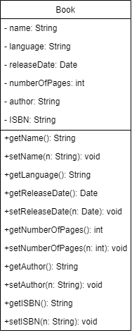

# Boekenkast

In plaats van een boek zoeken in een overvolle kast kun je dit ook automatiseren. 

Schrijf een programma waarmee je eenvoudig een lijst van boeken kunt opvragen/wijzigen/toevoegen.

##### Book object.


## Opdracht
1. Zorg ervoor dat alle test cases slagen. (BookServiceTest.java)
2. Laat zien in de main methode dat alle scenario's werken. 


Tips:
1. Implementeer de interface. (https://www.w3schools.com/java/java_interface.asp)
2. Om alle boeken op te slaan gebruik hiervoor een simpele List in je implementatie class. (https://dev.to/tacomanick/java-arraylists-a-dead-easy-tutorial-for-absolute-beginnners-8ig)
   ```java
       List<Book> books = new ArrayList<>(); 
    ```
3. Zorg ervoor dat het Book object de juiste methodes bevat (Zie diagram.)

# KISS (Keep It Simple Stupid/Keep It Stupid Simple).
De uitwerking hoeft niet fancy of moeilijk te zijn. 
Zorg er eerst voor dat de applicatie doet wat hij moet doen (MVP), daarna kunnen we nadenken over uitbreidingen. 

